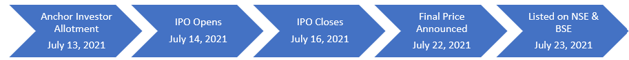

# 🧾 Zomato IPO Valuation & Strategy Analysis

This project is a full investment banking–style analysis of **Zomato Ltd.’s IPO**, covering both **equity valuation** and **IPO strategy execution**. It simulates how an analyst would approach a live deal — using publicly available data, real valuation techniques, and industry-standard visuals.

---

## 📘 Project Summary

- **Company**: Zomato Ltd. (Ticker: ZOMATO.NS)
- **IPO Date**: July 23, 2021
- **Offer Size**: ₹9,375 Cr
- **Issue Price**: ₹72–₹76 per share (final at ₹76)
- **Listing Gain**: +51%
- **Final Market Cap at IPO**: ₹64,365 Cr

---

## 📊 IPO Timeline

---

## 🧠 Key Objectives

1. Perform **Comparable Company Analysis (CCA)** to derive Zomato’s intrinsic valuation
2. Analyze **IPO pricing, anchor allocation**, and book-building strategy
3. Evaluate **post-listing stock performance** and compare it with **NIFTY50**
4. Reflect on the **strategic lessons** for future IPOs and bankers

---

## 🧮 Methods & Tools

| Method                         | Tools Used                         |
|-------------------------------|------------------------------------|
| Peer Valuation (EV/Revenue)   | Excel, Screener.in, yFinance API   |
| IPO Pricing Analysis          | RHP + Offer Document               |
| Timeline & Allocation Charts  | Matplotlib, Power BI               |
| Post-IPO Performance          | Yahoo Finance, NSE Index (^NSEI)   |
| Strategic Insights            | Financial news + equity research   |

---

## 📊 Visuals Included

- ✅ Waterfall Chart (IPO Market Cap → Peer-Implied EV)
- ✅ Peer EV/Revenue Comparison Bar Chart
- ✅ IPO Oversubscription by Investor Type
- ✅ Zomato vs NIFTY50 Stock Performance
- ✅ Zomato IPO Timeline

---

## 📄 Deliverables

| File | Description |
|------|-------------|
| `Final Report.pdf` | Full-length report (with appendix + references) |
| `Zomato_CCA_Template.xlsx` | EV/Revenue valuation model |
| `Charts` | Folder conatining all the necessary charts |
| `Zomato_IPO_Deck.pptx` | Slide deck with analysis and charts |

---

## 📚 Data Sources

- Zomato RHP & Final Offer Document
- Yahoo Finance & NSEpy
- Screener.in, Moneycontrol, Economic Times
- OECD & global annual reports (for comparables)

---

## ✍️ Author

**Harsh Garg**  
Aspiring Investment Banking Analyst | Finance & Economics Blogger  
🔗 [LinkedIn](https://www.linkedin.com/in/harsh-garg-54216820b/) | 🌐 [Portfolio](https://harshgarg001.github.io/Financial-Analyst-Portfolio/)

---

## 📁 License

Open for learning, non-commercial use. Please credit when reusing.

